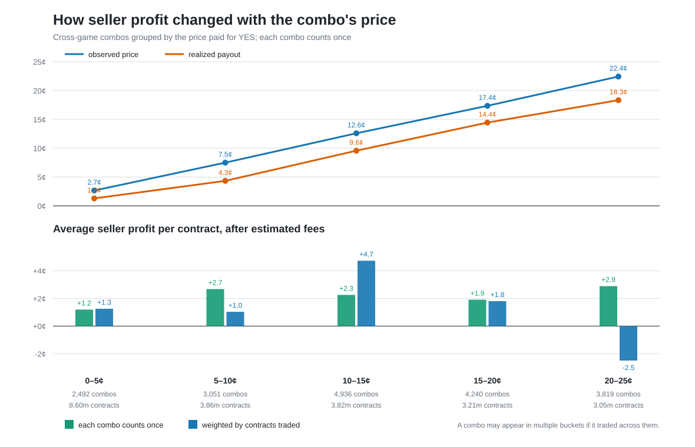
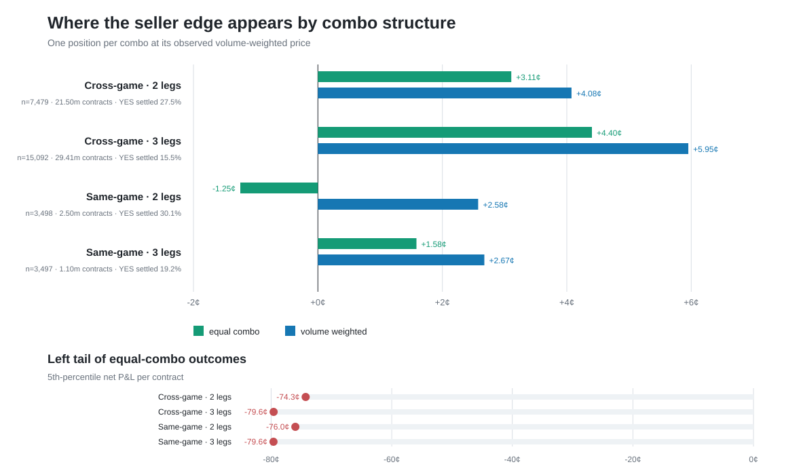
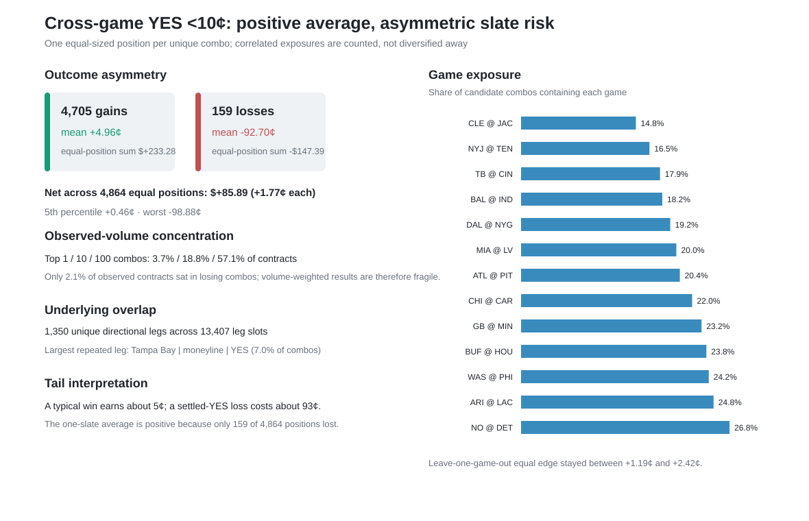
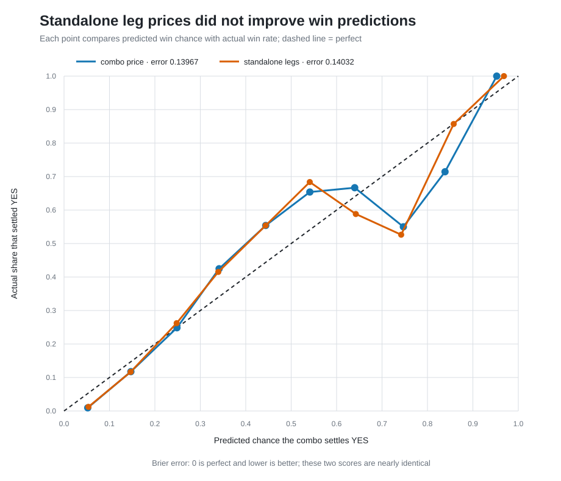
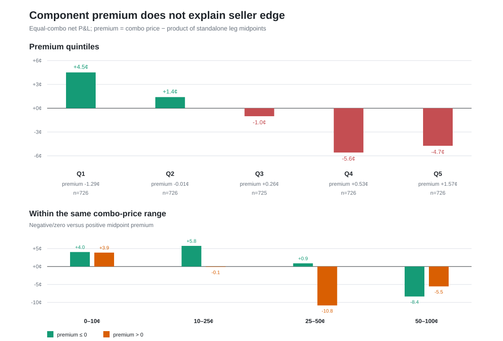

# NFL Market Edge

NFL Market Edge combines Bovada player-prop moves with executable Kalshi prices
to rank short-lived NFL market opportunities. The game/player-prop scorer is the
main usable tool; the repo also preserves the live collection pipeline and one
settled-Sunday combo study.

## Game/player-prop market scorer

Install dependencies, then rank the latest executable opportunities:

```bash
python -m pip install -r requirements.txt
python market_scorer/rank.py --latest-only --top 10
```

The output includes executable side, price and size; Bovada no-vig probability;
fee/slippage-adjusted edge; quote and neighboring-line checks; a coarse
recommendation; and historical 10/30-second markouts. See
[`market_scorer/README.md`](market_scorer/README.md) for model details, filters,
the live shadow scorer, and replay UI.

## Combo Research Findings

The settled Sep. 13 Sunday sample contains 29,566 traded 2/3-leg combo markets,
182,951 fills, and 54.51 million contracts. All recovered market volume
reconciles and no trade history was truncated. Seller return means taking the
NO/opposite side at the observed YES price, less the existing
`7% * price * (1 - price)` fee estimate; equal weight per combo is the primary
view and observed-volume weighting is the sensitivity check.

- Cross-game 2-leg and 3-leg combos returned +3.11¢ and +4.40¢ net per equal
  combo (+4.08¢ and +5.95¢ volume weighted). Same-game 2-leg was the weak cell
  at -1.25¢ equal weighted; same-game 3-leg returned +1.58¢. All four structures
  still had roughly -74¢ to -80¢ fifth-percentile outcomes.
- Cross-game YES `<10¢` covered 4,864 combos, 22,016 fills, and 12.47 million
  contracts. Mean price was 5.35¢ versus 3.24¢ realized settlement, producing
  +1.77¢ equal-weighted and +1.19¢ volume-weighted net. Results were positive
  for both 2-leg (+2.27¢/+0.65¢, n=1,185) and 3-leg
  (+1.60¢/+1.53¢, n=3,679) combos.
- Ten cents is not a meaningful cliff. Equal/volume-weighted net was
  +1.19¢/+1.25¢ at 0–5¢, +2.67¢/+1.04¢ at 5–10¢,
  +2.25¢/+4.72¢ at 10–15¢, and +1.91¢/+1.80¢ at 15–20¢. At
  20–25¢ it was +2.89¢/-2.49¢, showing a broader low-price pattern but unstable
  volume weighting.
- Risk is strongly asymmetric: 4,705 candidate positions gained 4.96¢ on
  average, while 159 lost 92.70¢ on average (worst -98.88¢). The top 100 combos
  supplied 57.1% of volume. Exposure spans all 13 games and 1,350 directional
  underlyings.







### Component fair-value follow-up

Standalone Kalshi legs mapped cleanly for 98.7% of cross-game combos, but only
3,629 had complete quotes no more than 30 seconds old with leg spreads at most
5¢. Their component-midpoint product averaged 21.40% against 21.66% settlement,
but its Brier score (0.14032) was slightly worse than the combo price itself
(0.13967).

Premium to component value was not a useful seller signal. Positive midpoint
premium returned -1.55¢ per equal combo versus +1.77¢ for the frozen `<10¢`
benchmark, and adding component value to a price-only cross-validated model did
not improve it (0.13847 versus 0.13844 Brier). For now, component pricing is a
sanity check rather than a selector.

The reusable combo scorer therefore keeps `<10¢` as the shortlist rule, reports
component fair value only as a diagnostic, and labels confidence as low until it
has forward-slate validation.





Improving this requires synchronized full books over multiple future slates,
combo quotes/RFQs, and enough repeated same-game leg pairs to model joint
probabilities.

## Supporting data pipeline

- The Bovada collector records receiving, rushing, and reception prop changes.
- The Kalshi collector records top-of-book changes, trades, lifecycle events,
  and connection gaps.
- The ESPN collector records live plays and corrections.
- Preprocessing and mapping scripts normalize those feeds into Parquet used by
  the scorer and research. The preserved Sunday capture is under
  `data/sunday_2026-09-13/`; Railway configs remain available for collectors.
